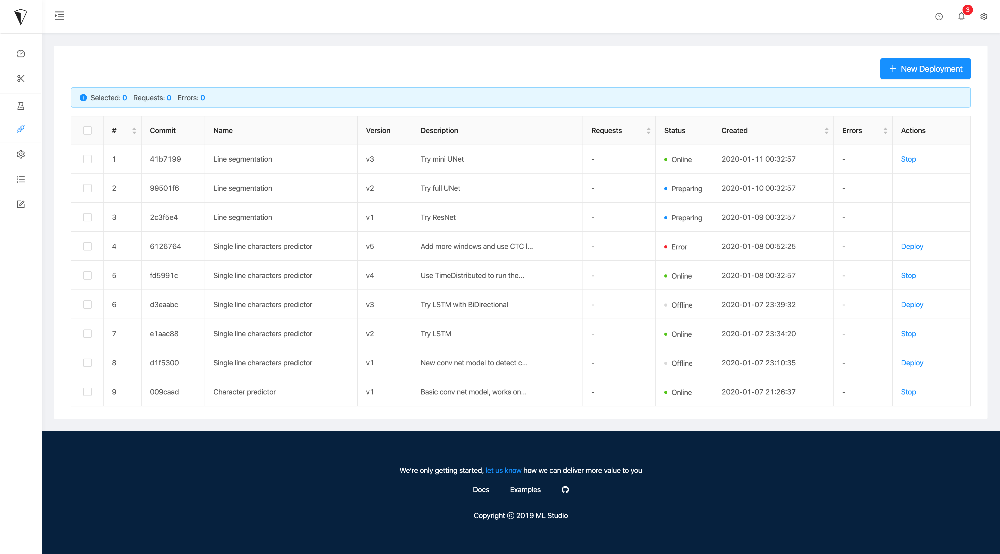
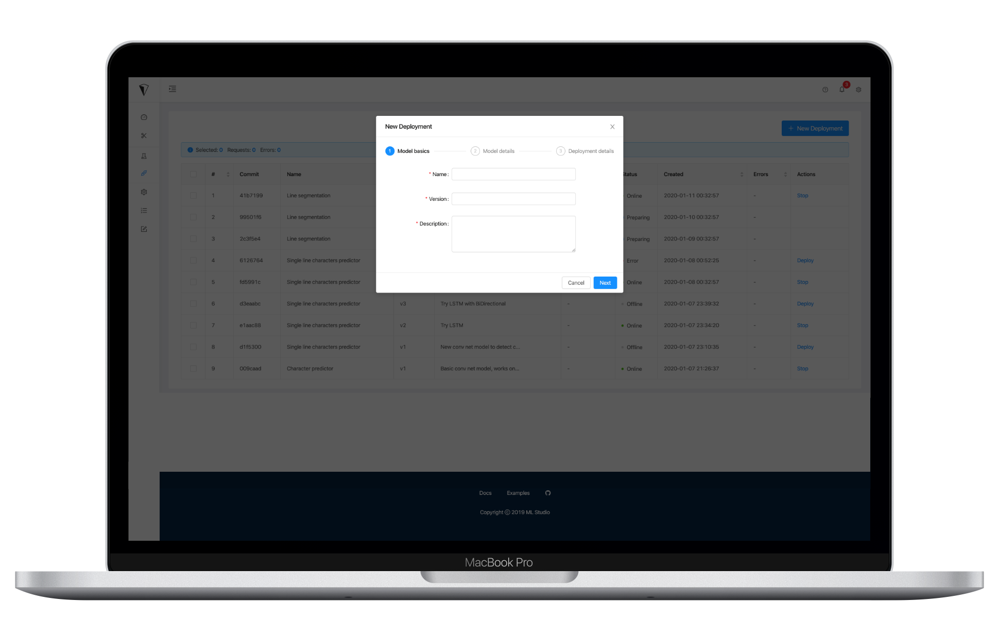

# Create a deployment

## New deployment requirements

You need 3 things to create a new deployment:

1. **An artifact file**. It will be copied to `/home/mlstudio/models` for later usage and reproducablity.
2. **A valid requirements.txt file**. It will be validated on submission to make sure everything there works.
3. **A python class for running the model**. A python class with your inference code.

```python
class UserModel(object):

    def __init__(self):
        # Load your model here
        pass

    def predict(self, data):
        # Your predication code goes here
        pass
```

Where `data` is `json` you would sent when calling the generated endpoint.

## Create a new deployment

Once you have the above files, open ML Studio and go to `Models` under `Serving`.


If you installed ML Studio locally, go ahead and access it via localhost. Otherwise run the following command to get its IP address.

```bash
kubectl get svc istio-ingressgateway -n istio-system
```




To add a new deployment, press `New Deployment` where you can add your model name, version and short description.



Then you will be prompted to select the files from the start of this page. And choose your prefered deployment infrastructure.


Finally, just wait a few minutes untill it is ready.


